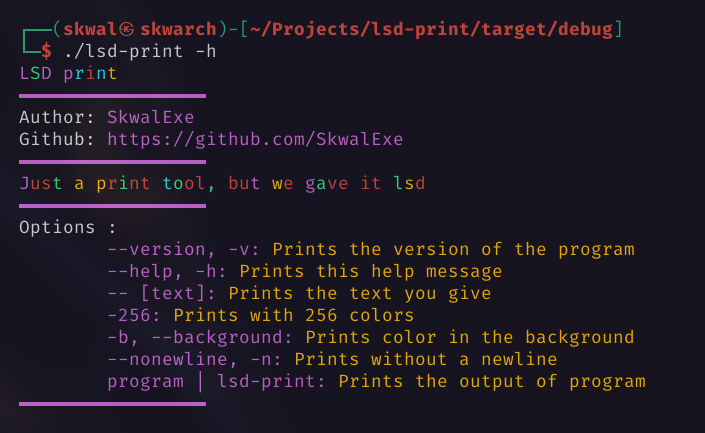

# lsd-print🧪


🧪 Just a print tool, but we gave it lsd

# Installation 📦

## Arch Linux

lsd-print is in the AUR

```bash
yay -S lsd-print
```

## Other distributions

### With make

Run make

```bash
# 📂 lsd-print/
make
```

### Or

**Clone this repo**

```bash
git clone https://github.com/SkwalExe/lsd-print.git
```

build with [cargo](https://doc.rust-lang.org/cargo/getting-started/installation.html)

```bash
# 📂 lsd-print/
cargo build --release
```

Move the binary

```bash
# 📂 lsd-print/
sudo cp target/release/lsd-print /usr/bin/lsd-print
```

# Usage 📝



## Example 

```bash
la | lsd-print -b 
``` 


# Docker 🐳

### Build 🛠️

```bash
# 📂 lsd-print/
docker build -t lsd-print .
```

### Run 🏃

```bash
docker run --rm -it lsd-print [OPTIONS]
```

# Uninstall 🗑

## With make

Run make uninstall

```bash
# 📂 help-ukraine/
make uninstall
```

## Or

Just remove the binary

```bash
sudo rm /usr/bin/lsd-print
```

# final

If you have any problem, don't hesitate to open an issue

# contributing

Pull requests are welcome. For major changes, please open an issue first to discuss what you would like to change.

<a href="https://github.com/SkwalExe#ukraine"></a>